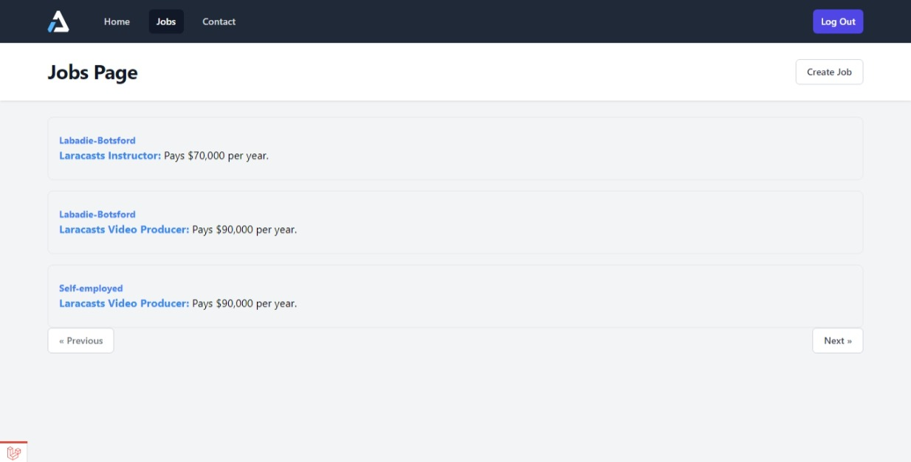

## Job Posting App Demo

This is a simple app created as a learning project using Laravel, following Laracasts's tutorial series. In this app, the user would be able to create and manage their job listings.

Tutorial: [30 Days to Learn Laravel - Complete 8 Hours Course](https://youtu.be/SqTdHCTWqks)

## Screenshot

